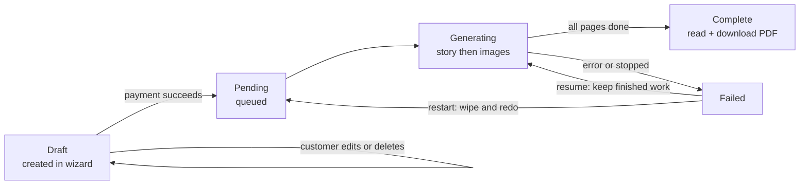

# CubFable - Business Logic (A to Z)

> This document explains how CubFable works as a business and as a product, in plain language for non-technical readers. It contains no code. It is the single source of truth for "what the product does and why". It must be kept up to date whenever the product's behavior changes.
>
> Last updated: 2026-07-19

---

## 1. What is CubFable?

CubFable is a website that turns a real child into the hero of their own illustrated storybook. A parent (or grandparent, aunt, uncle, family friend) visits the site, picks a story idea, personalizes it with the child's name, age, and optionally a photo, pays a small one-time fee, and the system automatically:

1. Writes a unique story starring that child.
2. Illustrates every page with AI-generated artwork where the child is recognizably the main character.
3. Assembles everything into a beautiful book that can be read on screen and downloaded as a print-quality PDF.

The buyer gets a personal keepsake: a real picture book about their own child, ready to read on a tablet or send to a print shop.

There are two kinds of people who use the system:

- **Customers**: regular registered users who create, buy, read, and download books.
- **Admins**: the site owner and staff. They manage the story catalog, tune how the AI behaves, watch revenue and AI costs, and fix books that failed to generate.

---

## 2. The customer journey, start to finish

### Step A: Landing page
Visitors see a marketing home page. It shows only anonymous totals (how many books have been created and completed). No customer's book or child is ever shown publicly.

### Step B: Browsing story ideas (templates)
The "story ideas" catalog is public, no login needed. Each idea is a **template**: a card with a cover picture, a title, a short description, a theme (space, ocean, dragons, bedtime...) and a recommended age range. Visitors can filter by theme and by the child's age.

There are currently **17 curated templates**, grouped by age:

- **Ages 2-4** (6-page books): Goodnight Little Moon (bedtime), Milo Finds His Mittens (home), The Very Busy Digger (construction), Nora's First Big Splash (swimming), Teddy's Turn to Share (playroom), The Garden's Tiny Parade (garden).
- **Ages 5-7** (8-page books): The Lantern in Whispering Wood (forest), Captain Coral and the Missing Pearl (ocean), The Cloud Factory Mix-Up (weather), Dragon School's Kindest Flame (dragons), The Great Neighborhood Build (neighborhood), Rocket Rescue on Planet Blue (space).
- **Ages 8-10** (10-page books): The Clockmaker's Secret Map (mystery), Expedition to the Living Glacier (arctic), The Library Between Worlds (fantasy), Codebreakers of Copper City (future city), The Debate of the Mountain Giants (mountains), The Last Seed of Sunvale (eco adventure).

Important rule: the template's description is the actual plot. The AI is required to tell that story, personalized around the child. The number of pages is fixed by the template (younger children get shorter books).

### Step C: The creation wizard (3 steps)
Creating a book requires an account, so visitors are asked to sign in or register first. Then a three-step wizard collects everything:

**Step 1 - The Hero (the child):**
- Child's name (this becomes the book title on the cover).
- Age band: 2-4, 4-6, 6-8, or 8-10.
- Optional photo of the child, with a crop tool so the face fills the frame. The photo is what makes the illustrations actually look like the child.
- Instead of typing everything again, a returning customer can pick a saved character from their personal "character library".

**Step 2 - Story settings:**
- **Art style**: one of six looks: 3D animation, cartoon, storybook, watercolor, soft anime, or comic book.
- **Subject**: a fun topic chip (15 options such as garbage trucks, dinosaurs, pirates, superheroes, space, fire department, camping, treasure hunts, time travel...).
- **Life lesson**: what the story should quietly teach (friendship, courage, care for nature, love, perseverance, sharing, honesty, respect).
- **Theme**: the story world, pre-filled from the template but editable.
- **Font**: Classic, Playful, or Handwritten lettering for the book.
- **Story language**: the wizard offers 8 languages (English, Arabic, Spanish, French, German, Italian, Portuguese, Turkish). The backend supports 12 in total (also Russian, Hindi, Urdu, Chinese). Arabic and Urdu books are laid out right-to-left, and Arabic is written as simplified Modern Standard Arabic with full diacritics, like a real printed children's book.

**Step 3 - Supporting cast and review:**
- Up to 5 extra characters (mom, dad, sibling, grandparent, best friend...), each with a name, their relation to the child, whether they are an adult or a child, a short description, and an optional photo. They default to "adult" so a parent is never accidentally drawn child-sized.
- A review card summarizes everything before submitting.

All characters (the hero and the cast) are saved into the customer's reusable character library, so the next book is faster to set up.

### Step D: Payment
Submitting the wizard creates a **draft** book and sends the customer straight to checkout.

- The price is a one-time fee per book (default **7.99 EUR**; the admin can change price and currency).
- Payment is processed by Stripe. The price is always decided by the server, never by anything the customer's browser sends.
- **Nothing is generated before payment.** This is a hard business rule: no AI money is spent on a book that has not been paid for.
- Unpaid drafts can be reopened, edited, or deleted by the customer. Once paid, a book becomes a locked keepsake.
- Payment confirmation is designed to be bulletproof: even if Stripe's confirmation message arrives late, the site double-checks with Stripe directly when the customer opens their book, so a paying customer is never left locked out.

### Step E: The book is generated (automatically)
The moment payment is confirmed, the book enters the generation pipeline (described in section 3). The customer can watch it happen live: the book page refreshes itself every few seconds, showing a status badge (Pending, Generating, Complete, Failed) and pages appearing one by one as the illustrations finish.

### Step F: Reading and downloading
The finished book opens in an on-screen reader styled like a night-sky picture book, with page-flip spreads and the cover displayed inside a decorative gold frame. The owner can:

- Read the book page by page.
- Edit the text of any page.
- Regenerate a single page's illustration if they don't like it.
- Regenerate the cover.
- **Restyle** the entire book into a different art style.
- Download the PDF in two variants: **Home** (clean digital copy) or **Print** (with bleed and crop marks so a professional print shop can print and trim it with no extra work).

Privacy rule: a book can only ever be opened by its owner. Anyone else trying the link gets a "not found" page, exactly as if the book did not exist.

---

## 3. How a book is actually made (the generation pipeline)

This all happens automatically in the background after payment. In order:

**1. The "book bible" is written first.** One AI call acts as both the author and the art director. It produces the complete story text (in the chosen language, page by page) plus a creative plan for the artwork: a description of the story world, a color and lighting mood for each page (for example moving from morning light to a starry night), a hidden "find-it" object drawn somewhere on every page as a game for the child, a short repeated refrain in the hero's voice, a cover subtitle, and per-page art direction (camera angle, action, the hero's facial expression, one small memorable detail). This bible is saved, so if anything is regenerated later, the book keeps the same world and look.

**2. The hero's visual identity is established.** By default the system first creates one "character sheet": a single stylized full-body illustration of the child based on the photo. That sheet is then used as the reference for the cover and every page, so the child looks consistent from page 1 to the end. (An admin can switch to a mode where the raw photo is used directly instead.) Each supporting character also gets a saved appearance description so they stay consistent too.

**3. The cover is illustrated**, with the book title lettered directly into the artwork. The admin can assign a special (possibly more expensive) image engine just for covers, since the cover is the image that sells the book.

**4. Every page is illustrated**, normally one at a time in order. With certain engines, the whole book can instead be drawn as one coherent batch so the characters and style match by construction; if that ever falls short, the system automatically falls back to page-by-page.

Some important behaviors baked into this pipeline:

- **Photos are repainted, never pasted.** Strict rules force the AI to fully redraw any referenced person in the chosen illustration style and dress them for the scene. A photo face is never copy-pasted into a page.
- **Only relevant characters appear.** A character is only drawn on a page if the story actually puts them in that scene.
- **Child-safety recovery.** If an image engine refuses a prompt for content-policy reasons, the system first tries the same, untouched prompt on a chain of alternative engines (admin-configurable, default: two other Seedream-family engines then Flux, all on Replicate where refused attempts cost nothing). Only when every engine has refused is the prompt rewritten once in a neutral way (never describing a child's body; also rewording innocent phrases a keyword filter could misread, like "grandfather clock") and the chain tried again. After those two rounds the image is flagged for human review in the admin "Review queue" instead of being retried further. A flagged item never destroys existing work: a page that already has a good illustration keeps it. Infrastructure errors (timeouts, rate limits) retry the same engine and never trigger a rewrite. The hero's character sheet never switches engines, because it anchors the hero's look for the whole book.
- **Age-appropriate writing rules.** The story engine follows craft rules per age band: 2-4 year-olds get 1-2 very short sentences per page, 8-10 year-olds get up to 3-5 richer sentences. Every story has a clear three-beat arc where the hero solves the problem themselves, the life lesson is woven in rather than preached, there are no invented nonsense words, and the hero is never shown sad, crying, scared, or distressed. Artwork must be weapon-free and non-frightening.
- **Nothing paid for is ever lost.** Every finished image is kept forever and versioned. If a book fails halfway, resuming it reuses the story and all completed images and only generates what is missing. The customer is never billed twice for the same page.
- **Where files live, and photo privacy.** Finished covers and page art are stored in cloud object storage and delivered through a fast content-delivery network, so a book's pages load quickly for anyone the owner shares them with. Uploaded photos of the child (and of extra characters) are treated as sensitive and kept in a separate private store, never placed on a public web address; when such a photo has to be shown back (in the wizard or the admin area), it is served through a short-lived private link that expires on its own.

**Book lifecycle at a glance:**

---

## 4. The final product: the PDF book

The downloadable PDF is built like a real published picture book, front to back:

Cover, half-title page, imprint/copyright page, a dedication page ("For [child's name], with all our love"), the story pages, a "The End" page, and a back cover ("Every child deserves to be the hero of their own story. Made for [child]").

- **Two download variants**: Print (3mm bleed, crop marks, prepress-ready) and Home (clean, trim only).
- **Page size** is chosen by the admin for the whole site, not by the customer. The default is a 210x210 mm square (the classic premium picture-book format). Other presets include an 8.5x8.5 inch square (print-on-demand standard), A4 and A5 in portrait or landscape, 8x10 inch, 10x8 inch, and US Letter.
- **How artwork sits on the page** is also an admin choice: full-bleed art with the text on a translucent panel (the default), a cropped art band above the text, or the whole image letterboxed.
- Images are optimized to print quality (300 DPI) while keeping the file a few megabytes.
- Fonts adapt to the language automatically, including proper right-to-left layout for Arabic and Urdu.

---

## 5. Money: pricing, payments, and cost control

- **Revenue**: one-time payment per book, default 7.99 EUR (admin-configurable price and currency: EUR, USD, GBP, TRY). Stripe handles the payment.
- **Costs**: every single AI call (story writing, vision, every image) is logged with its provider, model, tokens, and cost in USD. The admin dashboard shows total AI spend, spend per book, spend by model and by type of call, and the average AI cost of a completed book next to revenue. This is how the owner knows the margin per book.
- **Hard cost rules**:
  - No AI generation ever happens before payment.
  - Finished images are never regenerated or re-billed on resume.
  - Retries are bounded; a failed book waits for a human (or the customer) to explicitly resume it rather than burning money in a loop.

---

## 6. Accounts and security

- Registration is open by default but the admin can close it.
- New accounts must confirm their email address by clicking a link sent to their inbox. Right after signing up, the user lands on a "verify your email" screen where they can resend the link or skip for now; skipping is allowed, with a note that some features may stay hidden until the email is verified. Throwaway "disposable" email addresses (temporary inbox services) are rejected at sign-up. Accounts that existed before this rule are treated as already confirmed.
- Sign-in supports email and password, optional two-factor authentication, and passkeys.
- Only two roles exist: customer and admin (a flag on the user account).
- A customer can only see their own books, characters, and orders. Someone else's book behaves as if it does not exist.
- Payments can only be confirmed by trusted signals (Stripe's verified notification or a direct server-side check with Stripe), never by anything the browser claims.

### Fair use of free perks

The site quietly keeps track of which devices and network addresses each signed-in account uses, and notices when an address belongs to a VPN or a hosting provider rather than a home connection. Nothing is ever blocked and no one sees an error because of this: its only purpose is fairness when something is given away for free. When a free perk (such as a planned free demo book) is offered, each household gets it once; a person who makes a second account on the same device or network, or who shows up through a VPN, is simply shown the normal payment option instead of the free offer. Buying is always possible for everyone, from anywhere.

---

## 7. The admin area

Admins have their own section of the site with:

- **Dashboard**: revenue, AI spend, average cost per completed book, books by status, a 14-day trend of books created versus dollars spent, most popular art styles, and recent failures.
- **Settings**: all the business knobs, changeable live without redeploying. Highlights: which AI provider and model writes the stories (OpenAI, Gemini, or OpenRouter); which of seven engines draws the images (OpenAI, Gemini, OpenRouter, Flow, Grok, PiAPI, Replicate) and with what model; image quality tier (standard/high/max); image aspect ratio (default 3:4 portrait); whether the hero's identity comes from a character sheet or the raw photo; a dedicated cover engine; page size and art layout for the PDF; per-language fonts; whether uploaded photos are kept at original quality or optimized to save cost; the book price and currency; whether registration is open; and the allowed page-count range for templates (default 4 to 10).
- **Template management**: create and edit story templates (title, plot description, theme, age range, page count, allowed lessons/styles/subjects/fonts, and a cover art prompt), and generate real cover art for a template on demand. A template that already has customer books cannot be deleted.
- **Book operations**: view every book with its exact AI cost, read the full journal of every prompt sent to the image engines, see the story bible, browse the version history of every image (and restore any older version), and run rescue actions: resume a stuck book, restart it from scratch, stop a running job safely, "heal" a book that actually finished but was not marked complete, regenerate a single cover or page (optionally on a different engine to compare providers), restyle a whole book, or delete it.
- **Review queue (moderation)**: every cover or page that all engines refused as "sensitive" lands here. Each item shows the full attempt history (which round, which engine, which prompt variant, the exact provider error, when), the current image if one exists, and the page's scene wording. The admin can reword the scene, retry the image (optionally on a different engine), or dismiss the flag. The dashboard shows a live count.
- **Playground**: a test bench where the admin can preview every prompt the system would send for a book completely free (no AI is called), or fire a single real text or image call at any provider and model to test it, without touching the live settings.
- **Logs**: view, download, and clear application logs.

---

## 8. Art styles and image engines (business view)

- Customers choose from **six art styles**: 3D animation, cartoon, storybook, watercolor, soft anime, comic book. Four more exist in the internal library (crayon, clay animation, felt craft, paper lightbox) and several legacy styles are kept alive only so older books still render correctly.
- Each style is defined with a rich description of the medium, rules about what the style must NOT drift into, and instructions for adapting a real photo into that style.
- **Seven image engines** are supported, and each has different capabilities (for example, how many reference photos it can accept: some take none, some one, some up to six). The system automatically adapts: characters whose photo cannot be attached get a detailed written description instead, so every engine still produces consistent characters.
- The "Flow" engine is special: it is a locally-run browser gateway that drives Grok Imagine or Google Flow through a real browser session, keeping one whole book inside a single conversation for maximum visual consistency.

---

## 9. What is planned next (roadmap summary)

From the current backlog, in priority order:

- **Now (P0)**: bot protection on registration/login (Cloudflare Turnstile); much more detailed tracking of exactly where a generating book is, to power a better progress screen. (Smarter content-flag recovery with an engine fallback chain and an admin review queue shipped and is described in sections 3 and 7.)
- **Next (P1)**: a clearer live progress UI for customers; email notifications when a book completes or fails; an admin quality-assurance dashboard; letting customers resume a failed book themselves (with strict retry limits); a gift-a-storybook flow; one-click "make another book with this child and cast"; series/sequel support; discovering templates by occasion (birthday, new sibling, first day of school); wizard questions about the emotional goal of the book; a sibling/family bundle.
- **Later (P2)**: tiered products (digital-only, standard PDF, print-ready PDF as an upsell); richer character "passport" profiles.
- **Ideas (P3)**: an optional paid checkpoint where parents approve the story text before the (expensive) illustrations are made; a "Memory Book" mode that builds sentimental books from real family photos and memories.

Every roadmap item carries the same cost disciplines: no AI before payment, bounded retries, and strict per-owner privacy.

---

## 10. Keeping this document alive

This file is the product's living business documentation. Whenever a feature is added, changed, or removed (pricing, wizard steps, templates, languages, generation behavior, admin tools, roadmap status), this document must be updated in the same piece of work, and the "Last updated" date at the top must be refreshed. It should always read correctly to someone who has never seen the code.
